# Agentic LLM Architecture Flow

```mermaid
flowchart TD
    A[Agentic Call Request\nfrom Web Application\nFinal Prompt + Settings] --> B[Model Validation\nGemini 2.5+ Required]
    
    B --> C{Model Support Check}
    C -->|Not Supported| C1[Throw ValueError\nUnsupported Model]
    C -->|Supported| D[Initialize AgenticGeminiClient\nAPI Key Validation]
    
    D --> E[Function Call Logger\nClear Previous Logs\nStart Fresh Session]
    
    E --> F[Create Agentic Config\nPython Callable Functions\nNO Google Search Direct\nEnable Thoughts]
    
    F --> G[Main Agentic LLM Call\nGemini 2.5 with Tools\nNative Function Calling]
    
    G --> H{Function Calls\nDuring Processing?}
    
    H -->|Yes| I[Execute Custom Functions\nPython Callables]
    I --> I1[Back-Translation Validator\nvalidate back translation]
    I --> I2[Cultural Context Analyzer\nanalyze cultural context]
    I --> I3[Semantic Similarity Checker\ncheck semantic similarity]
    I --> I4[Search Expert\nexecute search expert]
    
    I4 --> I4A[Sub-Agent: Google Search\nSeparate Gemini Call\nReal-time Information]
    I4A --> I4B[Search Results Processing\nContext Integration]
    I4B --> I4C[Return to Main Agent]
    
    I1 --> J[Function Call Logging\nCapture All Interactions]
    I2 --> J
    I3 --> J
    I4C --> J
    
    H -->|No| K[Direct Processing\nNo Tool Usage]
    K --> J
    J --> L[Capture Function Logs\nThread-Safe Logger]
    
    L --> M[Extract Response Components\nThought Summary + Main Content]
    
    M --> N{Thought Summary\nPresent?}
    N -->|Yes| O[Extract Thought Summary\nAI Reasoning Process]
    N -->|No| P[No Thought Summary\nStandard Processing]
    
    O --> Q[Unstructured Content\nNatural Language Judgment]
    P --> Q
    
    Q --> R[Function Usage Detection\nSearch for Tool Keywords\nback-translation, search, etc.]
    
    R --> S[Structuring Phase\nConvert to JSON Format]
    
    S --> T[Create Structuring Prompt\nUnstructured to Structured\nTemplate-Based Conversion]
    
    T --> U[Second LLM Call\nGemini 2.0 Flash Fast\nStructure-Only Task]
    
    U --> V[JSON Schema Validation\n6 Boolean Criteria\nPydantic TranslationJudgment]
    
    V --> W{Validation Success?}
    W -->|Failed| W1[Return Structuring Error\nInclude Raw Responses]
    W -->|Success| X[Assemble Final Response\nStructured + Metadata]
    
    X --> Y[Response Assembly\njudgment + thought summary\n+ function logs + agentic features]
    
    Y --> Z[Return to Web Application\nRich Agentic Response]
    
    style A fill:#e1f5fe
    style F fill:#fff3e0
    style G fill:#e8f5e8
    style I fill:#fce4ec
    style I4 fill:#ffebee
    style I4A fill:#ffebee
    style J fill:#f3e5f5
    style S fill:#fff3e0
    style U fill:#e8f5e8
    style Y fill:#e1f5fe
    style Z fill:#e1f5fe
    
    classDef functionCall fill:#ffcdd2,stroke:#d32f2f
    class I1,I2,I3,I4 functionCall
    
    classDef subAgent fill:#f8bbd9,stroke:#e91e63
    class I4A,I4B,I4C subAgent
```



## Agentic Features Deep Dive

### Two-Layer Architecture
- **Main Agent**: Gemini 2.5 Pro/Flash with Python callable functions
- **Sub-Agents**: Separate Gemini calls for Google Search functionality
- **Function Isolation**: Search capabilities separated from main reasoning

### Custom Function Capabilities

#### 1. Back-Translation Validator
```python
validate_back_translation(translation, source_text)
```
- Validates translation accuracy by back-translating to English
- Uses GoogleTranslator for round-trip validation
- Provides confidence scores and semantic similarity

#### 2. Cultural Context Analyzer  
```python
analyze_cultural_context(text, target_culture)
```
- Analyzes cultural appropriateness and localization
- Checks for cultural references and context sensitivity
- Provides culture-specific recommendations

#### 3. Semantic Similarity Checker
```python
check_semantic_similarity(text1, text2)
```
- Measures semantic similarity between source and translation
- Uses embedding-based similarity scoring
- Identifies meaning preservation accuracy

#### 4. Search Expert
```python
execute_search_expert(query, context)
```
- **Two-Layer Design**: Main agent calls → Search sub-agent executes
- Real-time Google Search for translation verification
- Cultural context research and validation
- Current linguistic standards and guidelines

### Processing Phases

#### Phase 1: Agentic Generation
1. **Native Function Calling**: Gemini automatically determines tool usage
2. **Python Callables**: Direct function execution within LLM context
3. **Conversation Management**: Multi-turn dialogue with function responses  
4. **Thought Capture**: AI reasoning process extraction
5. **Function Logging**: Comprehensive call tracking

#### Phase 2: Response Structuring
1. **Unstructured Output**: Natural language judgment with tool insights
2. **Template-Based Conversion**: Structured prompt for JSON formatting
3. **Fast Model Processing**: Gemini 2.0 Flash for quick structuring
4. **Schema Validation**: Pydantic-based JSON validation
5. **Metadata Assembly**: Rich response with function call logs

### Agentic Advantages
- **Real-time Information**: Live Google Search integration
- **Multi-modal Analysis**: Back-translation, cultural, semantic checks
- **Transparent Reasoning**: Thought summaries and function logs  
- **Robust Validation**: Multiple validation layers and tool insights
- **Adaptive Processing**: LLM determines appropriate tool usage

## File References
- **agentic_judge_main.py:79** - Main generate_judgment method
- **agentic_judge_main.py:200** - Structuring conversion
- **agent_utils.py** - Function implementations and configurations  
- **agent_utils.py:21** - FunctionCallLogger class
- **agent_utils.py:106** - Agentic configuration creation