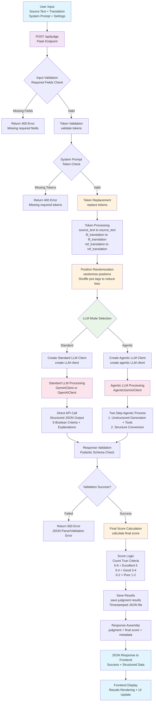

# Web Application Architecture Flow

## Key Components

### Input Processing Flow
1. **User Input** - Source text, translation, system prompt, and LLM settings
2. **Validation** - Required field checks and token validation
3. **Token Replacement** - Replace `{{source_text}}`, `{{fil_translation}}`, `{{ref_translation}}` placeholders
4. **Position Randomization** - Shuffle `<pos>` tagged content to reduce position bias

### LLM Processing Paths

#### Standard Path (Prompt-Engineered)
- Direct API call to Gemini or OpenAI
- Structured JSON output with 6 boolean criteria
- Single-step processing

#### Agentic Path (Enhanced Reasoning)
- Two-step process: Unstructured generation → Structure conversion
- Tool usage: Custom functions + Google Search sub-agents
- Thought summary capture for transparency
- Function call logging

### Output Processing
1. **Response Validation** - Pydantic schema validation
2. **Score Calculation** - Boolean criteria → numerical score (1-5)
3. **Results Storage** - Timestamped JSON files in `/results/`
4. **Frontend Response** - Complete judgment data with metadata

## File References
- **app.py:64** - Main `/api/judge` endpoint
- **prompt_utils.py:92-106** - Token replacement logic  
- **prompt_utils.py:108-109** - Position randomization
- **eval_utils.py:6** - Final score calculation
- **llms/prompt_engineered_judge_main.py** - Standard LLM clients
- **llms/agentic_judge_main.py** - Agentic LLM processing